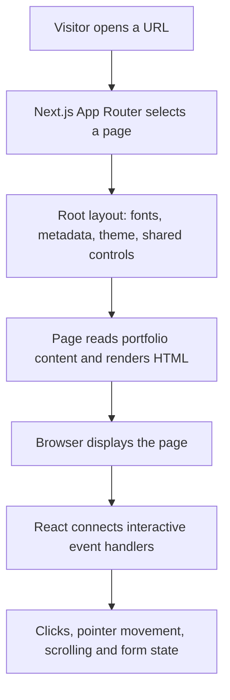
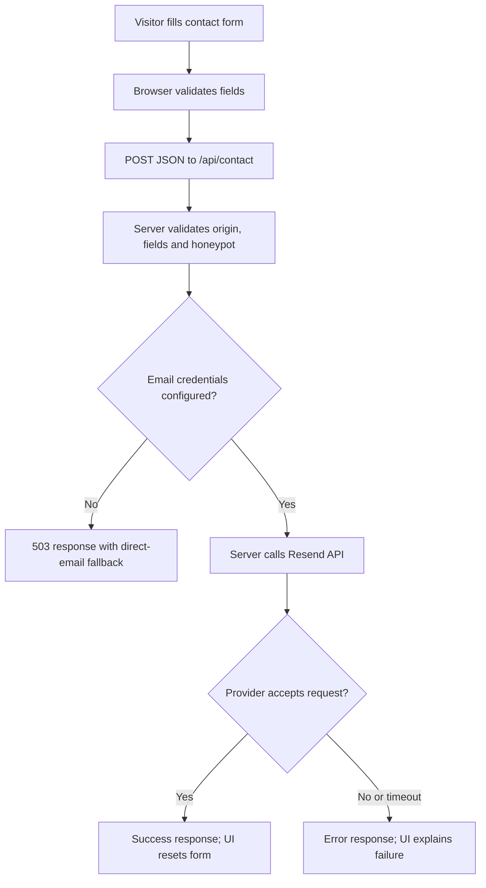

# Portfolio project guide


This guide explains the current Amit Singh Rana portfolio, how its parts connect, and where to make changes later. It describes the code as it exists on October 1, 2026.


## 1. Start here


The site is a Next.js application with a homepage, a contact page, four project case studies, and a server endpoint for contact messages. Most content comes from `data/portfolio.js`. Most visual styling comes from `app/globals.css`. Interactive components are grouped by feature in `components/`; see [the folder map](FOLDER_STRUCTURE.md) for individual files.


The design and motion were developed from the supplied Zolt portfolio reference and recordings. The implementation is custom React, CSS, and SVG code. It does not require Framer to run.


The supplied resume is the source for personal details, education, employment, projects, and numerical achievements. The supplied professional portrait is configured at `/images/amit-portrait.png` and used throughout the identity cards and avatars; initials remain as a fallback. Project covers are SVG concept illustrations, not screenshots of the live projects. Unprovided social profiles, project URLs, testimonials, and pricing were not invented.


For a quick change, use this table:


| What you want to change | Start in |

| --- | --- |

| Name, email, phone, skills, experience, projects | `data/portfolio.js` |

| Homepage section order or heading text | `app/page.jsx` |

| Colours, spacing, sizes, responsive layouts | `app/globals.css` |

| Card, folder, accordion, carousel, navigation interactions | `components/` |

| Bounce speed and physical movement | `lib/motion/card-physics.js` |

| Experience line fill and number gaps | `components/home/scroll-timeline.jsx` |

| Contact-page fields and submission messages | `components/contact/contact-form.jsx` |

| Contact validation or email provider request | `app/api/contact/route.js` |

| Contact credentials and public site address | `.env.local` |

| Resume PDF, images, fonts | `public/` |


## 2. Tools and dependencies actually used


| Tool | Purpose |

| --- | --- |

| Next.js 16.3.8 | App Router, page rendering, routing, API endpoint, metadata, image/font integration, builds |

| React 19.3.0 | Components, state, refs, effects, and interactive behaviour |

| JavaScript and JSX | Application logic and React component markup; ES modules are enabled |

| Tailwind CSS 4 and its PostCSS plugin | CSS build integration; imported from the global stylesheet |

| Custom CSS | Most of the actual layout, theme, responsive rules, and animation styling |

| `lucide-react` | Icons such as arrows, mail, download, graduation cap, and theme controls |

| Node.js and npm | Local development, production server, dependencies, and tests |

| Browser APIs | Pointer events, animation frames, observers, local storage, native dialogs, and scrolling |

| Resend HTTP API | Optional server-side contact-email delivery, once credentials are configured |

| Lighthouse 12.8.2 | Production performance, accessibility, best-practices, and SEO audits |

| Python, FontTools, Brotli | Optional maintenance tools for generating smaller font files |


There is no database, authentication system, Redux store, Framer Motion, GSAP, Three.js, or dedicated physics library in this website. Redux, GraphQL, Strapi, Express, Nodemailer, and other technologies shown in the skills section describe your professional experience; they are not automatically dependencies of this portfolio. The email endpoint currently calls Resend with `fetch`, rather than using Nodemailer.


Use Node 22 or newer for a consistent development and test environment. The tests run JavaScript directly with Node's built-in test runner. Normal application dependencies are installed with `npm install`. Python is not required to run the website.


`package.json` lists dependency ranges and commands. `package-lock.json` records resolved dependency versions. Preserve the lockfile to make installs repeatable.


## 3. Files and folders


```text
portfolio/
├── app/                         Next.js pages and server endpoints
│   ├── layout.jsx               Shared shell, fonts, theme, metadata
│   ├── page.jsx                 Homepage section order
│   ├── globals.css              Themes, responsive layouts, animations
│   ├── contact/page.jsx         Contact page
│   ├── projects/[slug]/page.jsx Project case-study route
│   └── api/contact/route.js     Contact validation and email delivery
├── components/
│   ├── home/                    Homepage sections and interactions
│   │   ├── hero.jsx             Greeting and draggable photo card
│   │   ├── about-cards.jsx      Portrait, flip card, folder, surprise note
│   │   ├── tech-stack.jsx       Skills marquees
│   │   ├── scroll-timeline.jsx  Experience rail fill
│   │   ├── expertise.jsx        Expertise accordion
│   │   ├── highlights.jsx       Achievements carousel
│   │   └── connect-section.jsx  Work-together and booking sections
│   ├── layout/                  Site-wide navigation and footer
│   │   ├── navigation.jsx       Profile pill and navigation dock
│   │   └── footer.jsx           Footer links and seal
│   ├── shared/                  Small reusable presentation components
│   │   ├── avatar.jsx           Portrait and initials fallback
│   │   ├── section-title.jsx    Section labels and headings
│   │   └── resume-link.jsx      Resume download button
│   ├── projects/
│   │   ├── project-grid.jsx     Project covers, cards, grid
│   │   └── case-study.jsx       Back link, progress menu, image lightbox
│   ├── contact/
│   │   ├── contact-form.jsx     Server-delivered contact form UI
│   │   └── contact-wizard.jsx   Homepage email-draft wizard
│   └── motion/
│       ├── motion-root.jsx      Visibility reveals and route transitions
│       └── pointer-motion.jsx   Pointer spring and tilt surface
├── data/portfolio.js            Editable personal and project content
├── lib/
│   ├── motion/card-physics.js   Pure hanging-card simulation
│   └── scroll-scheduler.js      Shared scroll/resize scheduler
├── public/                      Images, fonts, original resume PDF
├── tests/                       Physics and scheduler regression tests
├── scripts/                     Font maintenance script
├── docs/                        Architecture, motion, QA, performance guides
├── output/                      Generated reports, screenshots, project ZIPs
└── tmp/                         Ignored local tools; excluded from project ZIP
```


`node_modules/` is installed dependency code. `.next/` is generated Next.js output. Do not manually edit either. TypeScript source, configuration, generated declarations, and direct TypeScript development dependencies have been removed. `AGENTS.md` and `CLAUDE.md` contain coding-agent guidance; they are not visitor-facing application pages.


The alias `@/` points to the project root. For example, `@/data/portfolio` means the local `data/portfolio.js` module.


## 4. How the page rendering works





`app/layout.jsx` wraps every page. It adds the Satoshi font, the initial theme script, Skip to content, `MotionRoot`, the floating profile pill, the main content area, footer, and navigation dock.


The homepage and known project pages are pre-rendered during a production build. `generateStaticParams()` provides the four project slugs. The contact page is dynamic because it checks server environment variables to decide whether delivery is configured. The API endpoint runs on the server for each submission.


Pages are server components by default. Files beginning with `"use client"` contain browser interactions. The server can render their initial markup, then React hydrates them in the browser so buttons, effects, and state changes work. A client component is not the same as a page that has no server-rendered HTML.


`app/template.jsx` provides the `.page-transition` wrapper. `MotionRoot` applies a route-change animation after actual pathname changes. Initial page content is kept visible so visitors do not have to wait for an entrance animation before reading the hero.


## 5. Routes and visitor flow


| URL | What it shows |

| --- | --- |

| `/` | Full homepage |

| `/contact` | Contact form, profile, featured projects, expertise, highlights |

| `/projects/haldiram-d2c` | Haldiram contribution case study |

| `/projects/aditya-birla-calculator` | Calculator case study |

| `/projects/full-stack-ecommerce` | E-commerce case study |

| `/projects/taxi-booking` | Taxi-booking case study |

| `/api/contact` | POST endpoint; not a normal page |

| `/Amit_Resume.pdf` | Original resume asset |

| `/robots.txt`, `/sitemap.xml` | Search-engine resources |


The homepage order is:


1. Hero: greeting, introduction, CV download, contact CTA, hanging card.

2. About: identity card, technology flip card, education folder, desktop surprise note.

3. Featured work: all four project cards.

4. Skills, experience timeline, and detailed education cards.

5. Areas of expertise: five accordion panels.

6. Work highlights: three-slide achievements carousel.

7. Work-together section and homepage contact wizard.

8. Shared footer.


Important IDs are `main`, `home`, `about-me`, `work`, `stack-and-experience`, `education`, `service`, `highlights`, `how-it-work`, and `contact`. The contact page's form section uses `contact-form`.


An anchor such as `/#work` opens the homepage at Featured work. Keep IDs and links synchronized when renaming sections. Both Let's connect CTAs use `/contact#contact-form`, which explicitly identifies the form instead of relying on saved scroll position.


A project card opens its slug-based page. That page finds the matching record in `portfolio.projects`; an unknown slug calls `notFound()`. Its reading menu links to `point-0`, `point-1`, and subsequent section IDs. Related projects are the first two records remaining after excluding the current project. Back to home returns to `/#work`.


## 6. Content model and how to update it


`data/portfolio.js` exports one plain JavaScript `portfolio` object. This is the main content source, not a CMS or database. Editing it and rebuilding changes the website.


The main fields include personal details, `skills`, `skillGroups`, `experience`, `education`, `expertise`, `highlights`, and `projects`. A project includes its slug, titles, description, image, tags, role, optional organisation/duration/URLs, and case-study sections.


### Update personal details


Edit the corresponding values in `portfolio`. Place a real portrait in `public/images/`, then set `portrait` to a public URL such as `/images/amit-portrait.jpg`. A path beginning with `/images/` refers to `public/images/`; it is not a Windows filesystem path.


To update the resume, replace `public/Amit_Resume.pdf`. Keep the filename or update `portfolio.resume` and check every download. The original resume is copied into the repository; the running site does not read it from your Desktop folder.


### Add a project


1. Add its cover image to `public/images/`.

2. Add a record to `portfolio.projects` with a unique, URL-safe `slug`.

3. Fill in accurate titles, tags, role, description, image path, and `sections`.

4. Add `url` or `repository` only when verified. Their buttons are rendered only when those values exist.

5. Set an expertise item's `project` to the exact slug if it should link there.

6. Run the regression tests, rebuild, and test the new card and route.


The homepage grid, static project parameters, and sitemap derive from the project list. The contact page deliberately shows only the first two projects. The expertise component assumes its referenced project exists; changing or deleting a slug without updating expertise references can break rendering.


### Labels that need additional edits


Some presentation text is written directly in page/component files. Search before assuming a content-object edit changes every label:


- The education folder's MCA/B.Sc. IT names, years, GEHU label, and “2 degrees” are in `EducationFolder` in `components/`.

- The experience presentation in `app/page.jsx` includes the employer emblem, achievement heading, and a fixed “Present” ending. If adding a past employer, update that date rendering.

- Section titles and some work-together copy are in `app/page.jsx` and `components/`.

- Concept-cover labels and case-study image descriptions assume illustrative covers. Adjust them if replacing covers with genuine screenshots.


Use a search such as `rg "MCA|Present|GEHU" app components lib` to find these references. There are fields reserved for future content, such as social profiles; adding a content field does not automatically create a new UI section.


## 7. Styling, spacing, mobile layout and themes


`app/globals.css` starts with Tailwind's import, but most styling is written as named CSS classes. There is no separate Tailwind configuration file. PostCSS loads the Tailwind 4 plugin.


CSS variables under `:root` control backgrounds, surfaces, text, borders, orange/green accents, and shadows. `:root[data-theme="dark"]` provides the dark values. Change shared colours here before changing individual component rules.


The main mobile breakpoint is below 810px. Additional rules handle narrower widths such as 540px and 374px. Desktop folder rules start at 810px, with a size adjustment for 810–1000px. Hover rules also consider pointer capability.


Current mobile behaviour includes a bottom dock, one-column About cards, hidden surprise note and hero hanging card, and scroll-triggered folder expansion. Expertise preview images are hidden on mobile. Desktop uses a side dock and hover-based folder expansion. The About identity text has an explicit white override in dark mode.


General section top/bottom spacing previously set to 120px was reduced to 80px. Individual sections and mobile rules have their own spacing; do not replace every numeric padding value indiscriminately.


The stylesheet contains later overrides from the animation and responsive refinements. When a style appears unchanged, search for all matching selectors and media queries: a later applicable rule may override an earlier one.


Theme flow:


1. A small script runs before the page paints.

2. It reads the `theme` local-storage value.

3. With no saved choice, it checks the system colour preference.

4. It sets `data-theme` on the HTML element.

5. The dock button updates that attribute and saves the choice.


This reduces a light-theme flash when the visitor prefers dark mode. CSS supplies the visual transition. The theme is browser-local; it is not stored on a server.


## 8. Animation and interaction implementation


### Section entrances and decorative motion


`MotionRoot` observes `[data-reveal]` elements. Initially visible elements stay visible during hydration; later elements get `data-revealed="true"` when they enter view. CSS performs the blur/fade/position transition.


A second observer marks sections with `data-motion-visible`. CSS pauses decorative tracks, atoms, equalizers, and waving-hand movement when their section is off-screen. The multilingual greeting interval runs only while visible and the document is not hidden.


`prefers-reduced-motion` is respected by motion guards and CSS overrides. Preserve those rules when adding animation.


### Hanging profile card


`HangingCard` in `components/` handles pointer events and SVG drawing. `lib/motion/card-physics.js` handles physical state and integration.


The state tracks position (`x`, `y`), velocity (`vx`, `vy`), yaw, pitch, roll, and cord bend. Gravity pulls the badge down. Tension pulls along the stretched cord. Damping gradually removes energy. Releasing a drag retains recent throw velocity, while a stationary hold avoids creating a throw from an old pointer sample.


On entry, the card begins above its resting position and drops. After scrolling away and returning near the hero top, a new entry impulse starts. Small residual movement fades over roughly ten seconds under the tested entry conditions. Rebound peaks are roughly 0.6 seconds apart; stronger user throws can have different settling times.


`requestAnimationFrame` advances the state and paints transforms directly through refs. It does not re-render the entire React tree every frame. The simulation caps long elapsed frames at 0.1s and integrates in small steps up to approximately 240Hz for stability across display frame rates. The loop stops when the card is at rest.


The cord is an SVG cubic curve with a thick main stroke and highlight. Its endpoint follows the clip, and its bend trails card movement. Its gradient uses user-space coordinates so it remains visible when the cord becomes vertical. The badge is HTML/CSS with 3D transforms, not a 3D model or a video.


Keyboard arrows swing the card. Mobile-hidden and reduced-motion states skip the entry animation. Before changing gravity, stiffness, damping, resting length, or entry velocity, run the physics tests; they protect rebound timing and settling behaviour.


### Pointer spring and About cards


`usePointerSpring` in `components/motion/pointer-motion.jsx` smooths target changes into CSS variables. `TiltSurface` uses it for pointer-driven card tilt. It stops requesting frames when the spring settles and cleans up on unmount.


The technology card uses React state (`back`) and CSS classes to switch its content and appearance. The desktop note moves away from the mouse, resets on focus, and toggles a resume reveal when activated. Enter provides a keyboard route to the same action.


### Education folder


Desktop CSS hover separates the two paper cards and reverses the transforms when hover ends. MCA is the front paper in the closed state.


On mobile, JavaScript measures the folder centre relative to the viewport and sets `--folder-open` from 0 to 1. Near the centre, both papers move out; farther above or below it, they return to the folder. CSS transitions smooth the changes. Clicking the folder goes to the detailed education section.


### Experience progress line


`ScrollTimeline` measures the timeline container and calculates fill using a reading point at 55% of viewport height. Progress is clamped between 0 and 1, so it increases or reverses with scrolling.


A CSS mask creates transparent gaps around each number. The mask affects the track and orange fill, preventing the line from overlapping the numbers. `ResizeObserver` recomputes gaps when layout dimensions change.


### Other controls


- Expertise stores an open item index. It starts at index 0, closes when the open item is clicked again, and makes closed panels inert. The former cursor-following hover image is removed; the desktop image inside an expanded panel remains.

- Highlights stores a slide index and cycles through three resume-based achievements. It uses modulo arithmetic for wraparound.

- The top-centre profile pill becomes visible after scrolling more than 460px; it is also available on non-home pages. On the homepage it smoothly scrolls to the top. From other pages it links to `/#main`.

- The case-study reading control shows percentage progress and opens a list of section anchors. Selection closes the menu.

- The project lightbox uses a native `<dialog>` and supports its close button and Escape dismissal.


## 9. The two contact flows


These flows serve different purposes and should not be confused.


### Homepage wizard: prepares an email draft


```text

Choose a topic → enter name/email → enter message → open email draft

```


`ContactWizard` keeps topic, name, email, message, step, and error in React state. Next is disabled until a topic is selected. The second step checks name and email before advancing. Previous-step controls retain entered details.


The final link is a `mailto:` URL with an encoded subject and body. It opens a draft in the visitor's email application, if their device has a handler. It does not call `/api/contact`, and it does not send an email itself. Sending happens in that external application. A reload resets the wizard; there is no draft database.


### Contact page: sends through the server when configured





`app/contact/page.jsx` checks whether all three server email variables exist. It passes only a boolean `configured` to `ContactForm`; it does not pass API credentials to the browser. Without configuration, the page explains that delivery is unavailable and disables Send message.


`ContactForm` submits JSON, shows Sending while waiting, prevents another submission during that state, displays success or error text, and resets the form only on success. Provider acceptance is not a guarantee that an email reached the recipient's inbox.


The endpoint checks:


| Check | Current behaviour |

| --- | --- |

| Origin header differs from request URL origin | 403 |

| Declared Content-Length exceeds 16,000 bytes | 413 |

| Invalid JSON, fields, enquiry type, or filled honeypot | 400 |

| Missing email configuration | 503 |

| Provider failure or 15-second timeout | 502 |

| Accepted provider request | Success JSON |


Name is limited to 100 characters, email to 254, and message to 10–5,000 characters. Accepted enquiry types are Project enquiry, Career opportunity, and General conversation. `website` is a hidden honeypot field; normal visitors leave it blank.


Messages are not stored in a database. The server sends their contents to Resend, with the visitor's email as `reply_to`. The declared-length check is not a substitute for hosting-level body-size enforcement, and the endpoint has no built-in rate limiter. Add appropriate hosting/provider controls if traffic warrants them.


## 10. Environment variables and email setup


Create `.env.local` from `.env.example` on first setup. Do not overwrite an existing `.env.local` containing credentials.


```dotenv

RESEND_API_KEY=

CONTACT_TO_EMAIL=

CONTACT_FROM_EMAIL=

NEXT_PUBLIC_SITE_URL=http://localhost:3000

```


| Variable | Meaning |

| --- | --- |

| `RESEND_API_KEY` | Resend server API credential |

| `CONTACT_TO_EMAIL` | Inbox that receives enquiries |

| `CONTACT_FROM_EMAIL` | Sender address/domain verified with Resend |

| `NEXT_PUBLIC_SITE_URL` | Public deployment origin, used for metadata and search resources |


The first three stay server-side. Never rename an email credential with a `NEXT_PUBLIC_` prefix. `.gitignore` excludes environment files except `.env.example`; keep the example free of real secrets.


For a hosted site, set the variables in the hosting dashboard. Use a real HTTPS origin for `NEXT_PUBLIC_SITE_URL`, rebuild, and restart/redeploy after configuration changes. Keep the sender authorized by your provider; changing a string in the file alone does not verify a domain.


Actual email delivery has not been tested because credentials were not configured. After setup, make one controlled submission and verify the UI response, provider logs, received message, and reply address.


## 11. Local development and production commands


Run commands from the portfolio folder:


```powershell

cd C:\Users\AmitSinghRana\Desktop\careers\portfolio

npm install

npm run dev

```


Open `http://localhost:3000`. The development server rebuilds when source files change. Stop it with Ctrl+C.


For a production build:


```powershell

npm test

npm run build

npm start

```


Stop the development server first if both would use port 3000. To run the built production site alongside development on port 3001:


```powershell

node node_modules/next/dist/bin/next start -p 3001

```


`npm run build` must finish before `npm start`. Changes to source require a new production build. Tests now run ordinary JavaScript without a TypeScript loader or stripping flag.


## 12. Performance and search visibility


The improvements already implemented include:


- Immediate initial viewport visibility instead of delaying hero text for an entrance effect.

- A shared passive scroll/resize listener and one frame scheduler for profile, dock, and case-study progress controls. Timeline and folder measurements have their own frame scheduling.

- Pausing off-screen decorative animations and greeting updates; skipping hidden mobile card physics.

- Smaller local Satoshi font subsets: 76,440 bytes reduced to 46,696 bytes across three weights, approximately 39% smaller.

- Next.js image components with dimensions, and preload for the hero hand asset.

- `/images/` cache headers: one day of freshness and seven days of stale-while-revalidate.

- Canonical metadata, a sitemap, robots rules, heading/ARIA fixes, and removal of the powered-by header.


Observed Lighthouse lab results:


| Page/device | Performance | Accessibility | Best practices | SEO |

| --- | ---: | ---: | ---: | ---: |

| Homepage mobile before optimization | 93 | 96 | 100 | 100 |

| Homepage mobile after optimization | 99 | 100 | 100 | 100 |

| Homepage desktop | 100 | 100 | 100 | 100 |

| Contact mobile | 99 | 100 | 100 | 100 |

| Haldiram case study mobile | 97 | 100 | 100 | 100 |


These were local production runs, not guaranteed scores for every device or hosting provider. See `PERFORMANCE.md` for measured timings, report links, and run conditions. Audit production rather than development:


```powershell

npx --yes lighthouse@12.8.2 http://localhost:3001 --output=html --output-path=output/lighthouse.html --chrome-flags="--headless"

```


Chrome must be installed. Add `--preset=desktop` for a desktop audit.


### Font maintenance


Original fonts remain in `public/fonts/`; the app loads the `*-subset.woff2` files. The script preserves Latin, punctuation, arrows, and authored source characters supported by the original font.


If you add new text or another language, regenerate and verify glyph coverage:


```powershell

python -m pip install fonttools brotli

python scripts/subset-fonts.py

npm run build

```


This cannot create glyphs absent from the original font. An unsupported language may need a suitable additional font or fallback.


### SEO files


`app/layout.jsx` defines the default title, title template, description, and Open Graph metadata. Individual pages supply canonical URLs and page metadata. `app/sitemap.js` derives URLs from the project content, and `app/robots.js` allows normal pages while excluding API routes from crawling. Robots rules do not restrict API access.


Set the public origin before building. The localhost fallback is useful locally but must not become the deployed site's canonical address. The Open Graph preview currently references an SVG cover; if a sharing platform requires a raster preview, add a suitable PNG/JPEG and update the metadata.


## 13. Testing and maintenance


`npm test` runs ten meaningful regression tests: nine for card physics and one for the shared scroll scheduler. They cover entry overshoot, throws, stationary grabs, multiple frame rates, delayed frames, settling, slack gravity, rebound timing, and scroll subscriber cleanup/batching.


They do not automatically click the entire browser UI. `QA_REPORT.md` records the separate browser and HTTP checks. `output/qa-results.json` contains 187 recorded observations, not 187 independent automated assertions.


The UI checks covered six pages, desktop and mobile controls, additional responsive widths, project links, modals, section menus, themes, cards, folders, forms, downloads, and image/anchor integrity. Email-app launching was blocked in the test browser, so protocol destinations were inspected. No email was sent or call placed. Mobile checks used a resized browser rather than a physical phone.


After changing content or behaviour:


1. Run the regression tests and inspect the production build for errors.

2. Make a production build.

3. Check changed pages on desktop and mobile.

4. Click affected links and test both forward and return navigation.

5. Check dark mode, keyboard focus, reduced motion, and narrow widths.

6. Re-run Lighthouse if assets, fonts, layout, or animation execution changed.


Current checks found no failing internal controls. Email delivery remains the main incomplete external integration.


## 14. Deployment flow


Use a host that supports Next.js server routes and dynamic rendering. This project is not currently a plain static export because it includes a dynamic contact page and API endpoint.


The normal flow is: install dependencies → set environment variables → build → run with the platform's Next.js adapter or `npm start` → test the public URL.


No deployment is performed just by editing this repository. On deployment, verify canonical URLs, sitemap, resume URL, contact routing, asset loading, and configured email delivery. Audit the hosted production URL again because network and server conditions differ from localhost.


## 15. Troubleshooting


| Symptom | What to check |

| --- | --- |

| Port already in use | Stop the existing server with Ctrl+C, or use the alternate production-port command |

| Production does not show your latest edit | Rebuild and restart the production server |

| Send message is disabled | All three server email variables must exist; restart after adding them |

| Valid submission returns 502 | Provider configuration, verified sender, provider logs, and timeout |

| Contact request returns 403 on hosting | Request Origin versus the server's request URL, including proxy/origin configuration |

| Project page crashes after renaming a slug | Update expertise project references to the same slug |

| Education folder shows old labels | Edit the hardcoded folder presentation in `components/` too |

| New font characters look wrong | Regenerate subsets and check that the original font supports those characters |

| CSS change has no visible effect | Look for later selectors and applicable media-query overrides |

| Email/phone link does not open an app | Device/browser protocol-handler availability; verify `mailto:`/`tel:` destination |

| Lighthouse score is lower than the saved report | Confirm production mode, then compare device/network conditions and audit findings |

| Animation is absent | Check viewport breakpoint and reduced-motion preference; some motion is intentionally hidden or paused |


## 16. Read these files later


- `README.md`: short instructions to get running.

- `PROJECT_GUIDE.md`: architecture, flows, editing guide, and configuration.

- `MOTION_REFERENCE.md`: visual reference and motion implementation notes.

- `PERFORMANCE.md`: measured optimization results and Lighthouse artifacts.

- `QA_REPORT.md`: tested behaviours, browser evidence, and remaining limits.


Keep documentation synchronized when adding new features, changing environment variables, or replacing the email provider. The most useful first step for understanding the code is to follow `app/page.jsx` into its imported components, then compare their class names with `app/globals.css` and their content with `data/portfolio.js`.


## JavaScript conversion update


The application now uses `.js` and `.jsx` files, with `jsconfig.json` for the `@/` alias. `package.json` enables ES modules with `"type": "module"`. TypeScript and the direct `@types/*` development dependencies were removed. Resume text can still mention TypeScript as a professional skill. Saved Lighthouse/QA reports describe their earlier audit snapshots; rebuild and re-audit after significant changes. The hanging-card photo is now positioned absolutely inside the frame, with `object-fit: cover`, zero inner corner radius, and a card-specific crop.


## Technology card update

`components/home/technology-card.jsx` cycles through React & Next.js, Tailwind CSS, JavaScript, GraphQL, and Node.js & Express. Click, Enter, or Space advances one entry and wraps after the fifth. Edit its `stacks` array and matching SVG artwork in `StackIcon`. A keyed icon restarts the 850ms gravity-style bounce; text fades in over 350ms. Hover movement and the equalizer are removed. Reduced-motion preferences disable animations. Styling lives in `stack-drop` and `stack-copy-in` in `app/globals.css`.

## Mobile performance follow-up

The About portrait now preloads through the optional `preload` prop in `Avatar`. Reveal setup batches layout reads before DOM writes. Mobile CSS uses fade/slide transitions without blur. Static footer, section title, resume button, and project grid modules no longer declare `use client`; routes render them on the server. Their use inside an existing client component still follows Next.js client boundaries. See `PERFORMANCE.md` for current measurements and reports.
